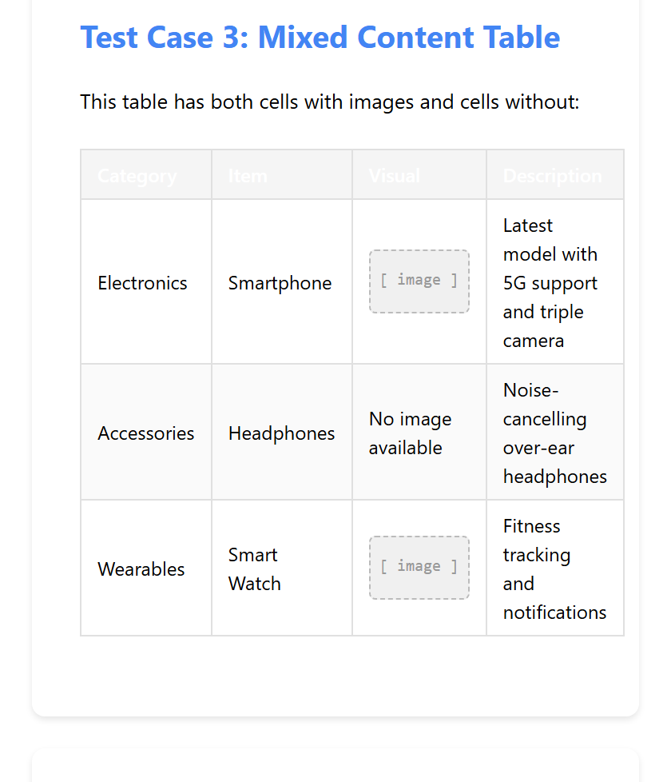

# Content Writing Assistant — User Manual
Version 1.1.0

---

## Overview

Content Writing Assistant is a Chrome extension for collecting and organizing web content. It lets you capture text, images, tables, and links from any webpage in a few clicks. All content is stored locally on your device — no accounts, no cloud, no tracking. It's built for writers and researchers who want a private, distraction-free way to gather material.

---

## Getting Started

### Installation

**What it does:** Loads the extension into Chrome so you can start capturing content.

**How to use it:**
1. Download or extract the extension folder from GitHub.
2. Open Chrome and go to `chrome://extensions/`.
3. Enable **Developer mode** using the toggle in the top-right corner.
4. Click **Load unpacked** and select the extension folder.
5. Click the puzzle-piece icon in the Chrome toolbar and pin the extension.

> 💡 **Tip:** Pinning the extension to the toolbar gives you one-click access to your content.

---

## Capturing Content

### Capturing Text Selections

**What it does:** Saves any text you select on a webpage, with an optional note.

**How to use it:**
1. Highlight any text on a webpage.
2. A popup appears near your selection.
3. Optionally type a note in the note field.
4. Press **Enter** or click **Save**.

> 💡 **Tip:** Press **Escape** to dismiss the popup without saving.

### Capturing Images

**What it does:** Saves an image from the page, including its source URL.

**How to use it:**
1. Hover over an image on any webpage.
2. Hold the cursor still for **1 full second**.
3. A popup appears — click **Save**.

**What to expect:** Images smaller than 50×50 pixels are ignored. If an image is CORS-protected, you'll see an "Image protected" message — save it manually instead.

### Capturing Tables

**What it does:** Saves an HTML table, preserving its structure and any embedded images.

**How to use it:**
1. Hover over a table on a webpage.
2. Hold still for **1 full second**.
3. A popup appears — click **Save**.

**What to expect:** Tables with fewer than 2 rows are ignored.

### Capturing Links

**What it does:** Saves a link's text and URL.

**How to use it:**
1. Hover over a link on any webpage.
2. Hold still for **1 full second**.
3. A popup appears — click **Save**.

### Multi-Element Capture

**What it does:** Lets you choose what to save when elements overlap (e.g., an image inside a link).

**How to use it:**
1. Hover over the overlapping element for 1 second.
2. A menu appears with options: **Image**, **Link**, **Table**, or **All**.
3. Select the option you want.

### Creating Content Manually

**What it does:** Lets you add content directly inside the extension popup, without capturing from a page.

**How to use it:**
1. Click the extension icon to open the popup.
2. Click the **+ New** button.
3. Type or paste your content.
4. Optionally upload files or add links.
5. Click **Save**.

---

## Managing Content

### Viewing Content

**What it does:** Shows all saved items in the current project.

**How to use it:**
1. Click the extension icon to open the popup.
2. Browse your saved items in the list.
3. Click any item to expand it and see the full content.
4. Click again to collapse it.

### Searching Content

**What it does:** Filters items by keyword across text, notes, sources, and URLs.

**How to use it:**
1. Press **Ctrl+K** inside the popup.
2. Type your search query.
3. Results update as you type.

### Editing Content

**What it does:** Lets you modify a saved item's text or notes.

**How to use it:**
1. Find the item you want to edit.
2. Click the **pencil icon** on that item.
3. Make your changes.
4. Click **Save**.

### Deleting Content

**What it does:** Permanently removes a saved item.

**How to use it:**
1. Find the item you want to delete.
2. Click the **trash icon** on that item.
3. The item is removed immediately.

> 💡 **Tip:** Press **Ctrl+Z** immediately after deleting to undo. Undo history is cleared when you close the popup.

### Reordering Content

**What it does:** Changes the order of items within the current project.

**How to use it:**
1. Click and hold an item for **0.5 seconds**.
2. Drag it to the desired position.
3. Release to drop it.

**What to expect:** Drag-and-drop is disabled on expanded items. Collapse an item before reordering.

### Undo and Redo

**What it does:** Reverses or re-applies recent actions like creates, edits, deletes, and reorders.

**How to use it:**
1. Press **Ctrl+Z** to undo the last action.
2. Press **Ctrl+Y** to redo.

**What to expect:** History is per-project and session-scoped. It clears when you close the popup. Maximum 50 actions are stored per project.

---

## Projects

### Creating a Project

**What it does:** Creates a new isolated workspace for your content.

**How to use it:**
1. Click the **folder icon** in the popup.
2. Click the **+** button.
3. Type a project name (2–50 characters).
4. Press **Enter** or confirm.

**What to expect:** If you have existing content in the default project, a dialog will ask whether to **Move**, **Copy**, or **Keep** it separate. Press **Escape** to keep content in the default project unchanged.

### Switching Projects

**What it does:** Changes which project's content is displayed.

**How to use it:**
1. Open the project dropdown in the popup.
2. Click the project you want to view.

### Renaming a Project

**What it does:** Changes a project's name.

**How to use it:**
1. Open the project dropdown.
2. Click the **⋮** menu next to the project.
3. Select **Rename**.
4. Type the new name (2–50 characters, must be unique).
5. Confirm.

### Deleting a Project

**What it does:** Removes a project and all its content.

**How to use it:**
1. Open the project dropdown.
2. Click the **⋮** menu next to the project.
3. Select **Delete** and confirm.

**What to expect:** The default project and the last remaining project cannot be deleted. If you delete the active project, the extension automatically switches to another project.

### Moving Content Between Projects

**What it does:** Transfers a saved item from one project to another.

**How to use it:**
1. Right-click any content item in the list.
2. Select **Move to Project**.
3. Choose the destination project.

---

## Exporting Content

### Copy All

**What it does:** Copies all content from the current project to your clipboard in a chosen format.

**How to use it:**
1. Click **Copy All** in the popup.
2. Select a format from the menu.
3. Paste into your document or tool.

**Available formats:**

| Format | Best for |
|--------|----------|
| **Full (Structured)** | Word documents, archiving — exports as formatted image via html2canvas |
| **Content + Notes** | Clean documents without source metadata |
| **Content + Notes + Source** | Research with full references |
| **AI Chatbot** | Pasting into ChatGPT, Claude, or similar tools |

> 💡 **Tip:** The **AI Chatbot** format uses `<item id="N">` tags. You can ask an AI to reference items by number, e.g. "summarize item 1".

---

## Keyboard Shortcuts

| Shortcut | Action |
|----------|--------|
| **Enter** | Save content (in capture or edit popup) |
| **Escape** | Cancel or close a modal |
| **Ctrl+K** | Open search |
| **Ctrl+Z** | Undo last action |
| **Ctrl+Y** | Redo last undone action |

---

## Troubleshooting

### "Refresh page" error after updating the extension

The content script on the current tab is outdated. Reload the webpage and try again.

### "Image protected" message when hovering an image

The image is blocked by CORS restrictions. The extension cannot access it automatically. Save the image manually by downloading it and using the **+ New** button to upload it.

### Hover popup doesn't appear

Make sure you are holding the cursor still for a full second. If the popup still doesn't appear, check that the element meets the size requirements: images must be at least 50×50px and tables must have at least 2 rows.

### Saved content is missing

Check whether you are viewing the correct project. Open the project dropdown and switch to the project where you saved the content.

---

*Generated by claudedoc*
